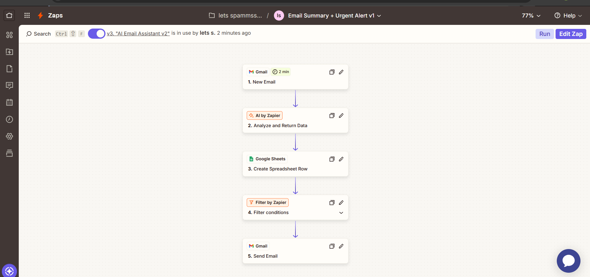
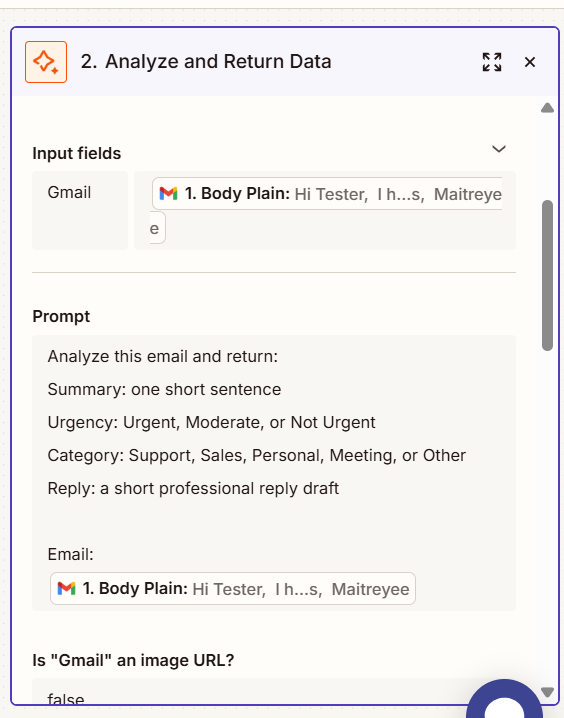
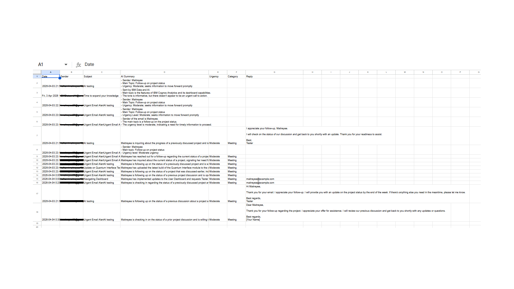
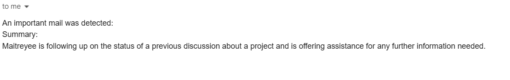

# AI Email Automation

## Overview
This project is a no-code AI automation built in Zapier. It:
- Summarizes incoming emails
- Detects urgency and category
- Generates suggested replies
- Stores all data in Google Sheets
- Sends alerts for urgent emails

## Screenshots

## Tools Used
- [Zapier](https://zapier.com/)
- [AI by Zapier](https://zapier.com/apps/ai/integrations)
- Gmail
- Google Sheets

## Future Improvements
- Structured AI output for separate fields automatically
- Tags/Labels for different senders
- Error handling paths
- Dashboard view for analytics
